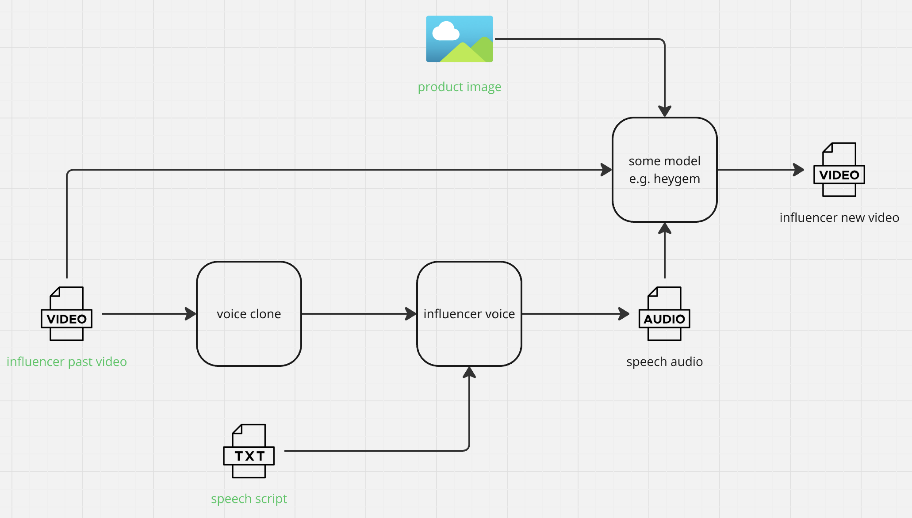

# Fit Mists Hackathon project for Trae x AI Entrepreneurs at Berkeley Hackathon

## archtecture 

## how to run

## deploy on https://novita.ai/console

- clone repos to novita gpu instance 

- scp audio file to instance

- scp video file to instance

- run spark tts to voice clone the audio file

- use heygem to dub the audio to the video file 

- scp the video file to local

- play the video file

- enjoy your new influencer product video 

